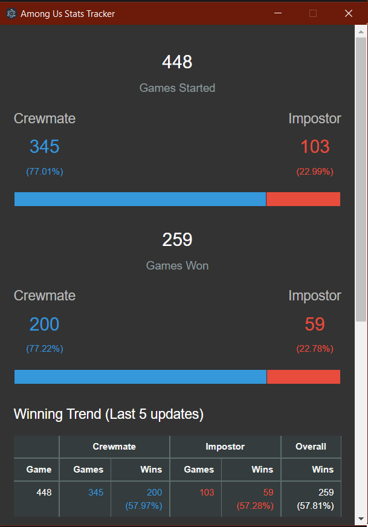

# Among Us Stats Tracker

A simple Among Us stats tracker for Windows 10 that displays info such as:

- Games Started (With breakdown on Crewmate/Impostor spread)
- Games Won (With breakdown on Crewmate/Impostor spread)
- Winning trend over the last 5 games (updates)
- General Stats
- Crewmate Stats
- Impostor Stats




# Roadmap

There are still features to add to Among Us Stats Tracker, such as:

- Customizable settings for update frequency, etc.


# Clients

Check out the releases section for the latest version. It should just be as simple as downloading the app and running it.


# Developers

I recommend that you use [Yarn](https://yarnpkg.com) to manage the dependicies required for developing.

This project is using a custom version of [Electron](https://github.com/SimulatedGREG/electron-vue) that includes Vue support.

## Project setup

### Install required dependencies

```
yarn install
```

### Compiles and hot-reloads for development

```
yarn run electron:serve
```

### Compiles a build for clients

```
yarn run electron:build
```

## Testing Suite

A full test suite will be coming soon

## Pull Requests

When creating a pull request make sure that you have rebased your branch off of `development` and resolved all merge conflicts. Once the test suite is in it will also need to be passing before a merge is made.

I will be accepting pull requests for both feature and bug fixes.